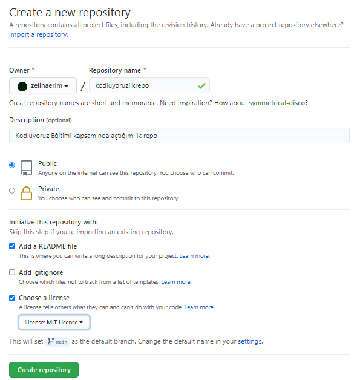

# kodluyoruzilkrepo
Kodluyoruz Eğitimi kapsamında açtığım ilk repo <br>

Bu repo Kodluyoruz Front-End Eğitiminde oluşturduğumuz ilk repo. İçerisinde bir adet README dosyası, bir adet de index.html barındırıyor.<br>




## Installation
Projeyi clone'lamak için code kısmından .git uzantılı linki kopyalayın:

```
https://github.com/zelihaerim/kodluyoruzilkrepo.git
```

## Usage
Projeyi cloneladıktan sonra Visual Studio Code programında açınız.

Linux için:
```
cd kodluyoruzilkrepo
code .
```
# Contributing
Pull requestler kabul edilir. Büyük değişiklikler için, lütfen önce neyi değiştirmek istediğinizi tartışmak için bir konu açınız.<br>

# License
[MIT](https://choosealicense.com/licenses/mit/) <br>
